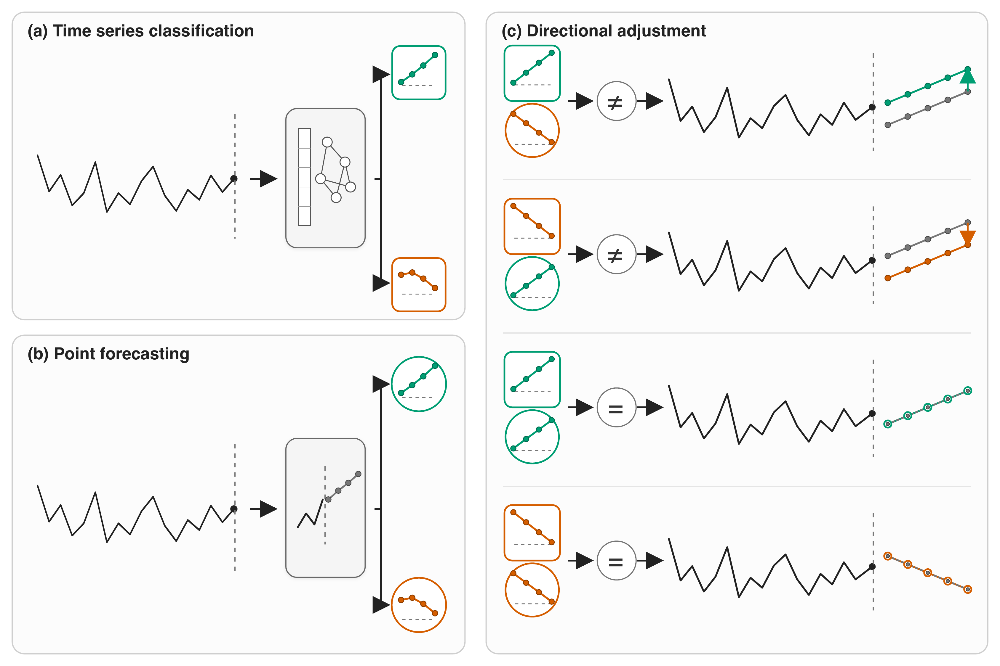
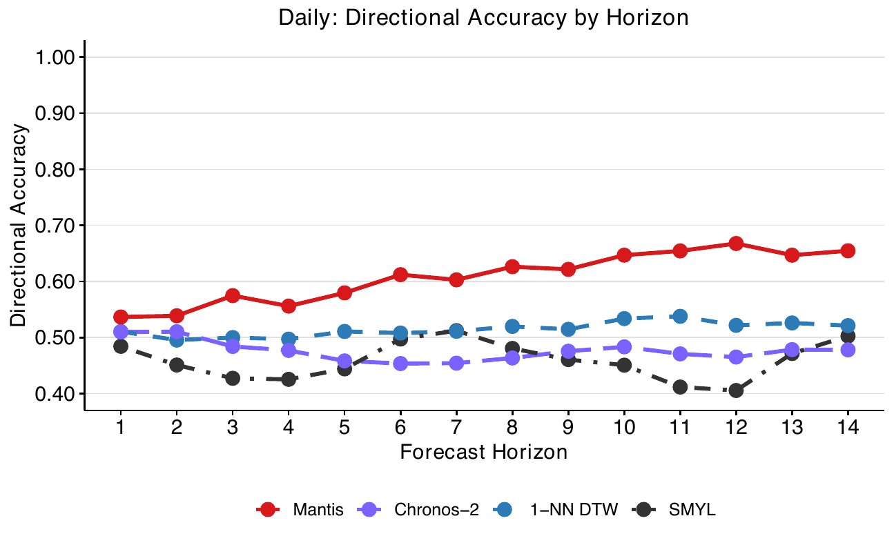
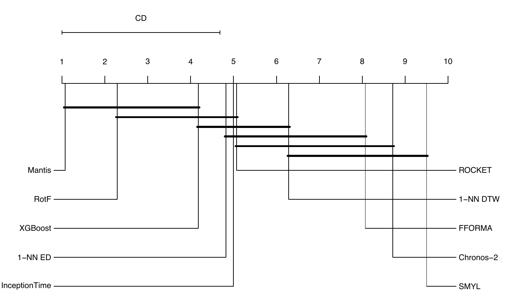
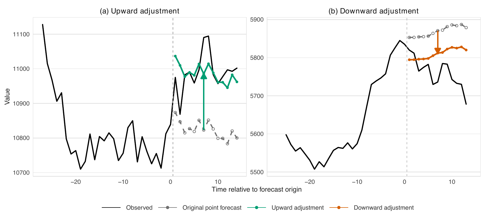

# A Step in the Right Direction

## Combining Point Forecasts with Foundation-Model Signals

Research code accompanying the FMTS \@ NeurIPS 2026 submission **A Step in the Right Direction: Combining Point Forecasts with Foundation-Model Signals**.



## Overview

Point forecasts estimate future values, but many operational and financial decisions depend on whether a quantity increases or does not increase. Directional accuracy captures this decision-relevant property, yet it is commonly treated as a by-product of point forecasting rather than as a prediction task in its own right.

This project introduces a **Directional Prediction Framework** that reformulates forecasting datasets as binary time-series classification tasks. Directional accuracy provides a common evaluation criterion for comparing point forecasting methods with time-series classifiers, including foundation-model-based approaches.

## Framework

At each forecast origin and horizon, the framework:

1.  Obtains a classifier-predicted directional label.
2.  Derives a directional label implied by the point forecast.
3.  Selects a multiplicative adjustment when the two labels disagree.
4.  Applies the selected adjustment to the point forecast.

An increase is the positive class; a zero or negative change is the non-increase class. Both the observed and predicted changes are measured relative to the forecast origin.

The adjustment is a post hoc exploratory proof of concept. It is not an optimal adjustment rule or an estimate of held-out performance.

## Experimental study

The study evaluates the framework on the M4 dataset, which contains 100,000 time series across six sampling frequencies and multiple forecast horizons.

The comparison covers:

- Point forecasting methods: SMYL, FFORMA, and Chronos-2.
- Time-series classifiers: 1-NN DTW, 1-NN Euclidean distance, Rotation Forest, XGBoost, ROCKET, InceptionTime, and Mantis.
- Evaluation across forecast horizons using directional accuracy.
- Exploratory directional adjustment evaluated with standard point-forecast error measures.

## Main findings

- Directional accuracy does not necessarily follow the same horizon-dependent pattern as point-forecast accuracy.
- On the M4 Daily subset, Mantis achieves higher directional accuracy at some longer forecast horizons.
- In the exploratory Daily analysis, Mantis-based directional adjustment reduces the OWA of SMYL and Chronos-2.
- The observed gains vary across sampling frequencies and forecasting settings.

The evidence is descriptive, conditional on the reported experimental design, and limited to the M4 dataset and evaluated methods.

### Directional accuracy across horizons

Figure 2 highlights the paper's central empirical observation on the M4 Daily subset. Mantis separates from the point-forecast-implied and conventional classification baselines at several longer horizons, while the accompanying critical-difference diagram summarises descriptive average ranks across the Daily forecast horizon.

<p align="center">

 

</p>

<p align="center">

<strong>Figure 2.</strong> Directional prediction results for the M4 Daily subset. <strong>Left:</strong> directional accuracy by forecast horizon. <strong>Right:</strong> descriptive average ranks across Daily forecast horizons.

</p>

### Directional adjustment in practice

Figure 3 illustrates how a learned directional signal complements an existing point forecast. When the classifier and point forecast imply different directions, the framework applies the corresponding upward or downward adjustment. The examples communicate the mechanism; they do not establish a general performance guarantee.



<p align="center">

<strong>Figure 3.</strong> Examples of directional adjustment. Mantis adjusts the SMYL forecast upward for M4 Daily series D1602 (left) and the Chronos-2 forecast downward for M4 Weekly series W39 (right).

</p>

## Installation

The project requires R, Conda, Git, and an internet connection for the initial package and model downloads. Run all commands from a terminal. The environment definitions support macOS on Apple silicon and Ubuntu 24.04.

Clone the repository and run the single setup script:

``` bash
git clone https://github.com/rafmontano/m4_tsc_fmts_2026.git m4_tsc_fmts_2026
cd m4_tsc_fmts_2026
Rscript --vanilla setup.R
```

The setup script creates the local `data/`, `models/`, and `results/` directories, prepares the isolated R library, installs the required R and Python packages, creates the Conda environments, and checks access to the Chronos-2 and Mantis checkpoints. Generated data, models, and results remain local and are not committed to the repository.

The first installation can take considerable time. The setup output reports five progress milestones. A successful installation ends with:

``` text
[100%] Completed step 5 of 5: Installation checks passed
Setup completed successfully.
```

## Environment selection

Manual `conda activate` commands are not required. Conda may display activation instructions while creating an environment, but those instructions are optional for this project.

| Workload | Environment selection |
|------------------------------------|------------------------------------|
| R data preparation, modelling, and reporting | R loads the project-local `renv` library. |
| Chronos-2 calls made from R | `reticulate` selects `m4_fmts_foundation` automatically. |
| Chronos-2 and Mantis Python runners | The command uses `conda run -n m4_fmts_foundation`. |
| Rotation Forest, ROCKET, and InceptionTime | The command uses `conda run -n m4_fmts_classifiers`. |

This explicit selection keeps the environments separate without requiring the reader to switch an active terminal environment.

## Running the project

Run the complete experiment and generate the paper results from the repository root:

``` bash
./run_paper_results.sh
```

The script runs six phases in sequence:

1.  R data preparation, modelling, and evaluation.
2.  Rotation Forest, ROCKET, and InceptionTime.
3.  Mantis.
4.  Chronos-2.
5.  Sensitivity analysis.
6.  Paper tables and figures.

The full experiment is computationally intensive. The script displays the active phase and records the duration of each phase and the complete pipeline in `results/runtime_<timestamp>.tsv`. Generated data, fitted models, results, and runtime records remain local and are excluded from version control.

## Reproducibility scope

The repository covers the reproducibility path from environment creation and data preparation through model execution, evaluation, result generation, and paper compilation.

The repository contains source code, scripts, configuration, environment and package definitions, and buildable paper sources. It does not version datasets, model weights, trained checkpoints, logs, caches, generated results, generated result figures, or compiled paper files.

## Read the paper

**A Step in the Right Direction: Combining Point Forecasts with Foundation-Model Signals**\
Foundation Models for Temporal Systems (FMTS), NeurIPS 2026

The [`paper/`](paper/) directory contains the manuscript source and build material. A compiled copy is available as [a-step-in-the-right-direction.pdf](paper/a-step-in-the-right-direction.pdf) for reading or download.

Citation information is withheld during double-blind review.
